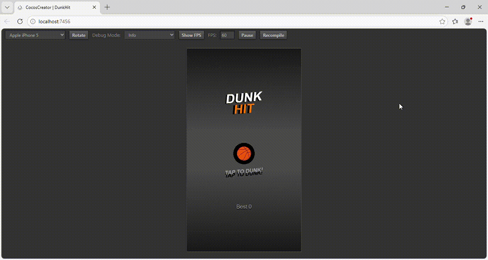
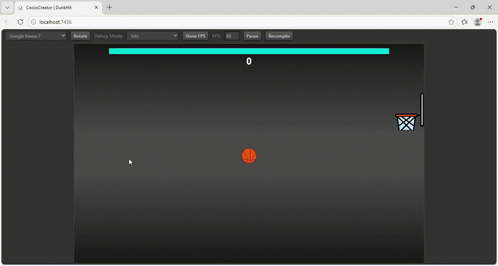
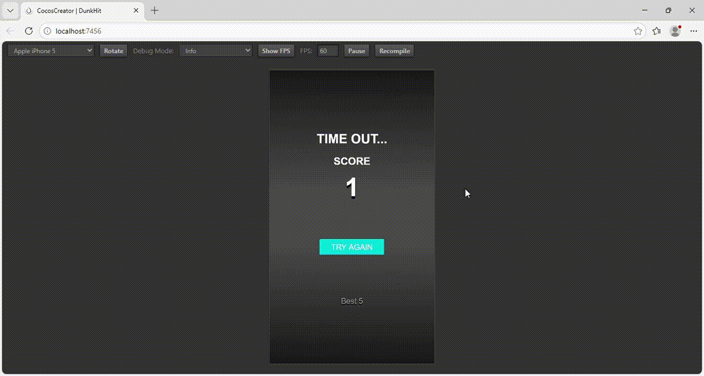

# Dunk Hit

## Описание проекта

Dunk Hit — мобильная игровая аркада, в которой игроку предстоит забрасывать мячи в корзину на время.

## Технологический стек

* **Движок:** Cocos Creator 2.4.10
* **Язык:** TypeScript
* **Анимации:** Tween.js (встроенный в Cocos) для реализации анимаций.

## Демонстрация

[Ссылка на игру](https://yaroslav20568.github.io/dunk-hit-test/)

|                  Demo                   |                  Adaptation1                   |                  Adaptation2                   |
| :-----------------------------------------------------------: | :--------------------------------------------------: | :--------------------------------------------: |
|  |  |  |

---

# Dunk Hit

## Project Description

Dunk Hit is a mobile arcade game where players aim to shoot balls into a hoop against the clock.

## Tech Stack

* **Engine:** Cocos Creator 2.4.10
* **Language:** TypeScript
* **Animations:** Tween.js (built into Cocos) for animations.

## Demo

[Game link](https://yaroslav20568.github.io/dunk-hit-test/)

| Demo | Adaptation1 | Adaptation2 |
| :----------------------------------------------------------: | :--------------------------------------------------: | :-------------------------------------------: |
|  |  |  |
