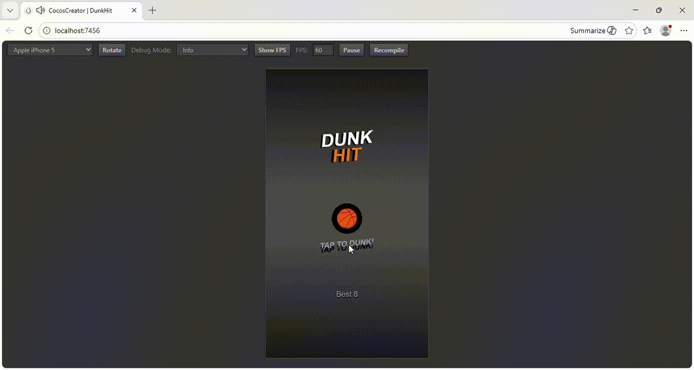

# Dunk Hit

## Описание проекта

Dunk Hit — мобильная игровая аркада, в которой игроку предстоит забрасывать мячи в корзину на время.

## Технологический стек

* **Движок:** Cocos Creator 2.4.10
* **Язык:** TypeScript
* **Анимации:** Tween.js (встроенный в Cocos) для реализации анимаций.

## Правки и Дополнительные задания VERSION-2

**Правки:** 
* Скорректированы начальные позиции для кольца (справа) и мяча (снизу на 33%).

**Дополнительные задания:** 

* При подбросе мяча добавить запуск системы частиц, которая закреплена на мяче. Продолжительность жизни частиц – 1 секунда.

* Добавить реализацию перемещения мяча за границы экрана: при вылете мяча в одну сторону он должен появиться в другой стороне с продолжением начальной траектории полета.

* Добавить следующие элементы после определенного количества набранных очков (При наборе 2 очков, в качестве теста):
1) периодическое движение корзин по оси Y;
2) систему частиц дыма за мячом (визуал не слишком важен, главное – работа с ParticleSystem), запускается после череды идеальных попаданий и затухает при прерывании серии;

* Добавить удвоение очков при идеальном попадании в корзину. Идеальным считается попадание, где мяч не задевает кольцо.

## Демонстрация

[Ссылка на игру](https://yaroslav20568.github.io/dunk-hit-test/)

|                  Demo                   |                  Demo-v2                   |
| :-----------------------------------------------------------: | :--------------------------------------------------: |
|  |  |

|                  Adaptation1                   |                  Adaptation2                   |
| :-----------------------------------------------------------: | :--------------------------------------------------: |
|  |  |

---

# Dunk Hit

## Project Description

Dunk Hit is a mobile arcade game where players aim to shoot balls into a hoop against the clock.

## Tech Stack

* **Engine:** Cocos Creator 2.4.10
* **Language:** TypeScript
* **Animations:** Tween.js (built into Cocos) for animations.

## Edits and Additional tasks edits VERSION-2

**Edits:** 
* Скорректированы начальные позиции для кольца (справа) и мяча (снизу на 33%).

**Additional tasks:** 

* When the ball is tossed, trigger a particle system attached to the ball. The particle lifespan is 1 second.

* Add implementation of the ball movement beyond the screen boundaries: when the ball flies out in one direction, it should appear in the other direction, continuing its initial flight trajectory.

* Add the following elements after a certain number of points (for a test, after scoring 2 points):
1) Periodic movement of the baskets along the Y axis;
2) A system of smoke particles behind the ball (the visuals aren't too important, the main thing is working with the ParticleSystem), which starts after a series of perfect hits and fades out when the series is interrupted;

* Double the points for a perfect basket. A perfect basket is defined as a basket where the ball does not touch the hoop.

## Demo

[Game link](https://yaroslav20568.github.io/dunk-hit-test/)

|                  Demo                   |                  Demo-v2                   |
| :-----------------------------------------------------------: | :--------------------------------------------------: |
|  |  |

|                  Adaptation1                   |                  Adaptation2                   |
| :-----------------------------------------------------------: | :--------------------------------------------------: |
|  |  |
